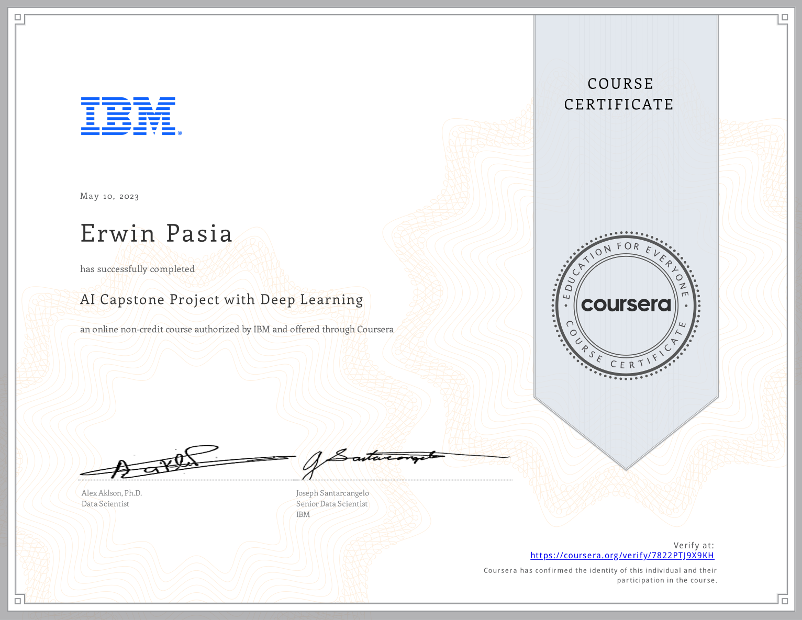

# [IBM AI Engineering Professional Certificate's Capstone Project](https://www.coursera.org/account/accomplishments/verify/7822PTJ9X9KH) - COMPLETED!
The IBM AI Capstone Project with Deep Learning offers two distinct learning streams: a PyTorch stream and a Keras stream. Each stream focuses on building different types of classifiers using deep learning techniques.

**A. PyTorch Stream: Linear Classifier**

In the PyTorch stream, participants will learn how to build a linear classifier. A linear classifier is a simple yet powerful model used for classifying data into distinct categories by drawing a linear decision boundary. Here's an overview of the process:

- **Data Preparation:** Load and preprocess the dataset, which typically involves normalizing the data and splitting it into training and testing sets.

- **Model Building:** Implement a linear classifier using PyTorch. This involves defining a model class that inherits from torch.nn.Module, initializing weights, and defining the forward pass.

- **Training:** Use stochastic gradient descent (SGD) or another optimization algorithm to train the model. The loss function often used is cross-entropy loss for classification tasks.

- **Evaluation:** Test the model on unseen data to evaluate its performance, usually by calculating metrics such as accuracy.

Linear classifiers are foundational in machine learning and serve as building blocks for more complex models.

**B. Keras Stream: Image Classifier with ResNet50**

In the Keras stream, participants will focus on building an image classifier using the ResNet50 pre-trained model. ResNet50 is a deep convolutional neural network with 50 layers, known for its ability to handle complex image classification tasks using residual learning:

- **Transfer Learning:** Leverage the pre-trained ResNet50 model on ImageNet data. This involves using existing weights from a large dataset to improve performance on a smaller dataset.

- **Model Customization:** Modify the ResNet50 architecture by removing the top layers (using include_top=False) and adding custom layers suitable for the specific classification task.

- **Freezing Layers:** Freeze the initial layers of ResNet50 to retain learned features and only train additional layers added for the specific task.
Training and Fine-Tuning: Train the new layers on your dataset. Optionally, fine-tune some of the deeper layers with a low learning rate to further improve performance.

- **Evaluation:** Validate the model's performance using metrics such as accuracy, precision, recall, etc.

This approach allows participants to harness powerful pre-trained models without needing extensive computational resources or large datasets.

Both streams provide practical experience in developing deep learning models and applying them to real-world problems, enhancing participants' skills in data pre-processing, model building, training, evaluation, and reporting results.

In this course there will be not much new learning, instead students will "focus on hands-on work" to demonstrate and apply what they have learnt in the previous courses.

By successfully completing this Capstone, students will add projects to their Machine Learning Engineering and AI Engineering portfolios to showcase to employers.

## [Certificate Of Competency:](https://www.coursera.org/account/accomplishments/verify/7822PTJ9X9KH)

    

